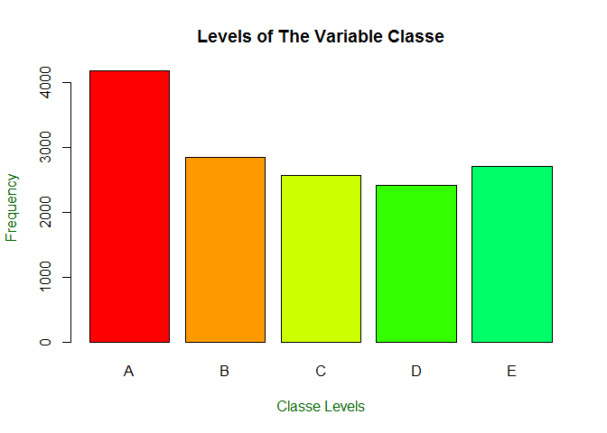
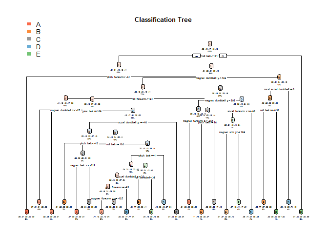

## **Abstract**
***
Making use of smart devices for example Jawbone Up, Nike FuelBand, and Fitbit gives the possiblity to gather large amount of data about personal activity relatively inexpensively. These type of devices are part of the quantified self movement – a group of enthusiasts who take measurements about themselves regularly to improve their health, to find patterns in their behavior, or because they are tech geeks. One thing that people regularly do is quantify how much of a particular activity they do, but they rarely quantify how well they do it. In this project, our goal will be to use data from accelerometers on the belt, forearm, arm, and dumbell of 6 participants. They were asked to perform barbell lifts correctly and incorrectly in 5 different ways.

The goal of this project is to predict the manner in which they did the exercise. This is the `classe` variable in the training set.

## **Data Description**
***
The resulting variable is **classe**, of a factor variable with 5 levels. Participants were asked to perform one set of 10 repetitions of the Unilateral Dumbbell Biceps Curl in 5 different fashions For this data set:

- Class A - Exactly according to the specification
- Class B - Throwing the elbows to the front
- Class C - Lifting the dumbbell only halfway
- Class D - Lowering the dumbbell only halfway
- Class E - Throwing the hips to the front

## **Preliminary Configuration**
***
The preliminary configuration comprises of loading some required packages and initializing numerous variables.


```r
## [Declaring Data Variables]

TRAINING_FILE   <- './data/pml-training.csv'
TESTCASE_FILE <- './data/pml-testing.csv'

TRAINING_URL_LINK    <- 'http://d396qusza40orc.cloudfront.net/predmachlearn/pml-training.csv'
TESTCASE_URL_LINK  <- 'http://d396qusza40orc.cloudfront.net/predmachlearn/pml-testing.csv'

## [Creating Folders]

if (!file.exists("data")){
  dir.create("data")
}
if (!file.exists("data/submission")){
  dir.create("data/submission")
}

## [Installing R-Packages]

## [caret]
CHECK_CARET_INSTALLED <- require("caret")
```

```
## Loading required package: caret
```

```
## Loading required package: lattice
```

```
## Loading required package: ggplot2
```

```r
if(!CHECK_CARET_INSTALLED){
    install.packages("caret")
    library("caret")
    }

## [randomForest]
CHECK_RANDOM_FOREST_INSTALLED <- require("randomForest")
```

```
## Loading required package: randomForest
```

```
## randomForest 4.6-14
```

```
## Type rfNews() to see new features/changes/bug fixes.
```

```
## 
## Attaching package: 'randomForest'
```

```
## The following object is masked from 'package:ggplot2':
## 
##     margin
```

```r
if(!CHECK_RANDOM_FOREST_INSTALLED){
    install.packages("randomForest")
    library("randomForest")
    }

## [rpart]
CHECK_RPART_INSTALLED <- require("rpart")
```

```
## Loading required package: rpart
```

```r
if(!CHECK_RPART_INSTALLED){
    install.packages("rpart")
    library("rpart")
    }

CHECK_RPART_PLOT_INSTALLED <- require("rpart.plot")
```

```
## Loading required package: rpart.plot
```

```r
if(!CHECK_RPART_PLOT_INSTALLED){
    install.packages("rpart.plot")
    library("rpart.plot")
    }

## [Setting Seed for Reproducability]

set.seed(9999)
```

## **Data Processing**
***
within this frame of reference, in this section the data is downloaded and processed. Some essential transformations & cleanup will be performed to omitt `NA` values. Irrelevant columns will be removed from the subset (column 1 to 7) for example:

- user_name
- raw_timestamp_part_1
- raw_timestamp_part_2
- cvtd_timestamp
- new_window
- num_window

The `pml-training.csv` data is used to devise training and testing sets and besides this The `pml-test.csv` data is used to predict and answer the 20 questions based on the trained model.


```r
## [Download Data]

download.file(TRAINING_URL_LINK, TRAINING_FILE)
download.file(TESTCASE_URL_LINK,TESTCASE_FILE )

## [Clean Data]

TRAINING <-read.csv(TRAINING_FILE, na.strings=c("NA","#DIV/0!", ""))
TESTING  <-read.csv(TESTCASE_FILE , na.strings=c("NA", "#DIV/0!", ""))

TRAINING <-TRAINING[,colSums(is.na(TRAINING)) == 0]
TESTING  <-TESTING[,colSums(is.na(TESTING)) == 0]

## [Subset Data]

TRAINING   <-TRAINING[,-c(1:7)]
TESTING <-TESTING[,-c(1:7)]
```

## **Cross-Validation**
***
Cross-validation will be performed here by splitting the training data in training `75%` and testing `25%` data.


```r
SUB_SAMPLES <- createDataPartition(y=TRAINING$classe, p=0.75, list=FALSE)
SUB_TRAINING <- TRAINING[SUB_SAMPLES, ] 
SUB_TESTING <- TRAINING[-SUB_SAMPLES, ]
```

## **Expected Out-of-Sample Error**
***
The anticipated out-of-sample error will correspond to the quantity, `1-accuracy` in the cross-validation data. Accuracy describes the proportion of correct classified observation over the total sample in the subTesting data set. Expected accuracy is the expected accuracy in the out-of-sample data set i.e. original testing data set. consequently, the expected value of the out-of-sample error will correspond to the expected number of missclassified observations/total observations in the Test data set, that is the quantity: `1-accuracy` found from the cross-validation data set.

## **Exploratory Analysis**
***
The variable `classe` contains 5 levels. The plot of the outcome variable shows the frequency of each levels in the subTraining data.


```r
plot(SUB_TRAINING$classe, col=rainbow(10), main="Levels of The Variable Classe", xlab="Classe Levels", ylab="Frequency", col.lab="darkgreen")
```

<!-- -->

The resulting plot above exhibits that most frequent classe is Level A on the other hand D is indicating the least frequent classe.

## **Prediction Models**
***
In this section `random forest` and a `decision tree` will be applied on data.

## **Random Forest**
***

```r
## [Fit Model]

RF_MODEL_FIT <- randomForest(classe ~ ., data=SUB_TRAINING, method="class")

## [Perform Prediction]

RF_PREDICT <- predict(RF_MODEL_FIT, SUB_TESTING, type = "class")
```

## **Decision Tree**
***

```r
## [Fit Model]

DT_MODEL_FIT <- rpart(classe ~ ., data=SUB_TRAINING, method="class")

## [Perform Prediction]

DT_PREDICT <- predict(DT_MODEL_FIT, SUB_TESTING, type = "class")

## [Plot Result]

rpart.plot(DT_MODEL_FIT, main="Classification Tree", extra="auto", under=TRUE, faclen=0, box.palette="auto", tweak=2.2)
```

```
## Warning: labs do not fit even at cex 0.15, there may be some overplotting
```

<!-- -->

## **Confusion Matrix**
***
Following confusion matrix presenting the errors of the prediction algorithm.


```r
confusionMatrix(DT_PREDICT, SUB_TESTING$classe)
```

```
## Confusion Matrix and Statistics
## 
##           Reference
## Prediction    A    B    C    D    E
##          A 1247  212   23   83   30
##          B   32  530   73   23   73
##          C   35   96  695  112  121
##          D   60   66   46  532   46
##          E   21   45   18   54  631
## 
## Overall Statistics
##                                           
##                Accuracy : 0.7412          
##                  95% CI : (0.7287, 0.7534)
##     No Information Rate : 0.2845          
##     P-Value [Acc > NIR] : < 2.2e-16       
##                                           
##                   Kappa : 0.6712          
##                                           
##  Mcnemar's Test P-Value : < 2.2e-16       
## 
## Statistics by Class:
## 
##                      Class: A Class: B Class: C Class: D Class: E
## Sensitivity            0.8939   0.5585   0.8129   0.6617   0.7003
## Specificity            0.9008   0.9492   0.9101   0.9468   0.9655
## Pos Pred Value         0.7818   0.7250   0.6563   0.7093   0.8205
## Neg Pred Value         0.9553   0.8996   0.9584   0.9345   0.9347
## Prevalence             0.2845   0.1935   0.1743   0.1639   0.1837
## Detection Rate         0.2543   0.1081   0.1417   0.1085   0.1287
## Detection Prevalence   0.3252   0.1491   0.2159   0.1529   0.1568
## Balanced Accuracy      0.8974   0.7538   0.8615   0.8043   0.8329
```

Following confusion matrix presenting the errors of the prediction algorithm.


```r
confusionMatrix(RF_PREDICT, SUB_TESTING$classe)
```

```
## Confusion Matrix and Statistics
## 
##           Reference
## Prediction    A    B    C    D    E
##          A 1393    5    0    0    0
##          B    2  942    1    0    0
##          C    0    2  854    8    0
##          D    0    0    0  795    2
##          E    0    0    0    1  899
## 
## Overall Statistics
##                                           
##                Accuracy : 0.9957          
##                  95% CI : (0.9935, 0.9973)
##     No Information Rate : 0.2845          
##     P-Value [Acc > NIR] : < 2.2e-16       
##                                           
##                   Kappa : 0.9946          
##                                           
##  Mcnemar's Test P-Value : NA              
## 
## Statistics by Class:
## 
##                      Class: A Class: B Class: C Class: D Class: E
## Sensitivity            0.9986   0.9926   0.9988   0.9888   0.9978
## Specificity            0.9986   0.9992   0.9975   0.9995   0.9998
## Pos Pred Value         0.9964   0.9968   0.9884   0.9975   0.9989
## Neg Pred Value         0.9994   0.9982   0.9998   0.9978   0.9995
## Prevalence             0.2845   0.1935   0.1743   0.1639   0.1837
## Detection Rate         0.2841   0.1921   0.1741   0.1621   0.1833
## Detection Prevalence   0.2851   0.1927   0.1762   0.1625   0.1835
## Balanced Accuracy      0.9986   0.9959   0.9982   0.9942   0.9988
```

## **CONCLUSION**
***

### **Predicting Results**

The confusion matrices exhibit, that the Random Forest algorithm performens is prevailing over decision trees. The accuracy for the Random Forest model was `0.995` (95% CI: (0.993, 0.997)) in contrary to `0.739` (95% CI: (0.727, 0.752)) for Decision Tree model. The random Forest model is selected.

### **Expected Out-of-Sample Error**
The expected out-of-sample error is approximated at 0.005, or `0.5%`. The expected out-of-sample error is calculated as `1-accuracy` for predictions made against the cross-validation set. Our Test data set consists of 20 cases. With an accuracy above `99%` on our cross-validation data, we can anticipate that very few, or none, of the test samples will be missclassified.

## **Submission**
In this section we used random forest algorithm on the testing data to generate the files for the project submission.


```r
## Perform Prediction

SUBMISSION_PREDICTION <- predict(RF_MODEL_FIT, TESTING, type="class")
SUBMISSION_PREDICTION
```

```
##  1  2  3  4  5  6  7  8  9 10 11 12 13 14 15 16 17 18 19 20 
##  B  A  B  A  A  E  D  B  A  A  B  C  B  A  E  E  A  B  B  B 
## Levels: A B C D E
```

```r
## Write Files for Submission

WRITE_FILES = function(x){
  n = length(x)
  for(i in 1:n){
    FILE_NAME = paste0("./data/submission/prob_id_",i,".txt")
    write.table(x[i],file=FILE_NAME,row.names=FALSE,col.names=FALSE,quote=FALSE)
  }
}

WRITE_FILES(SUBMISSION_PREDICTION)
```
